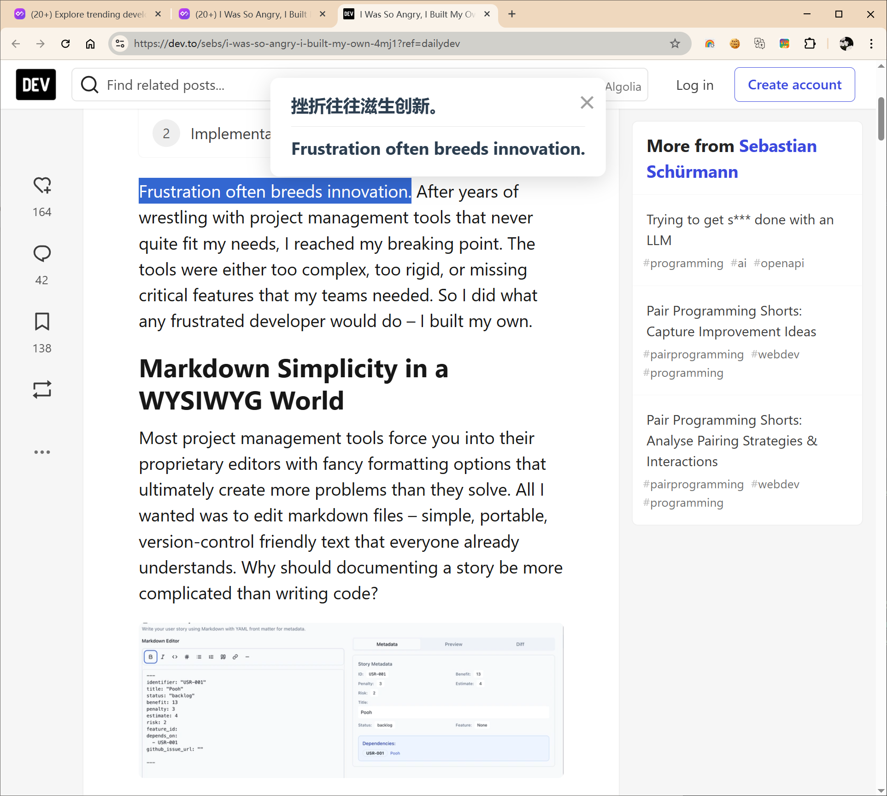
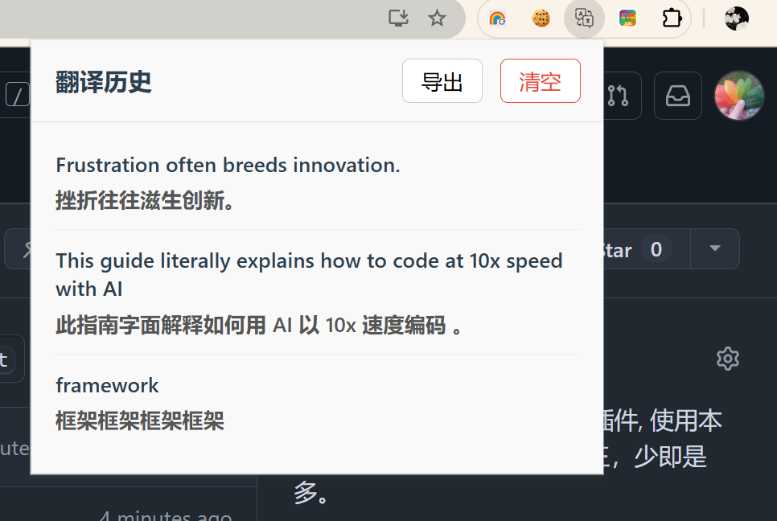

# 立马翻译 (Immediately Translate) - Chrome 插件

“立马翻译”是一款为效率和简洁而生的 Chrome 浏览器插件。它专注于提供最核心的翻译功能：将用户在网页上选中的英文文本（单词或句子）即时翻译成中文。产品摒弃一切冗余功能，旨在为用户提供一个零干扰、响应迅速、操作无缝的沉浸式翻译体验。

--- 

## 项目起源, 起因
[见这里](https://blog.csdn.net/waterHBO/article/details/148702167?spm=1001.2014.3001.5501)

## 写的过程
[在这里](https://blog.csdn.net/waterHBO/article/details/148725898?spm=1001.2014.3001.5501)

## ✨ 功能特性 (Features)

*   **极致简洁 (Simplicity):** 只提供核心的划词翻译功能，无任何不相关的设置或广告。
*   **即时响应 (Instantaneity):** 从用户发起翻译指令到看到结果，感知延迟降到最低。
*   **无缝体验 (Seamless Experience):** 翻译结果在当前页面内顶部横幅展示，不打断用户当前的浏览流程。
*   **网络兼容性 (Network Compatibility):** 插件的网络请求适应用户的系统代理设置。
*   **历史记录 (History):** 自动保存翻译历史，方便回顾。
*   **导出功能 (Export):** 可将翻译历史导出为 JSON 格式，作为生词本使用。

---

## 🛠️ 安装指南 (Installation Guide)

  
### 手动加载本地文件 (Load Unpacked)

如果你想从源代码安装，或者在插件上架前试用，可以按照以下步骤操作：

1.  **下载代码 (Download the Code):**
    *   克隆本仓库到本地：`git clone https://github.com/your-username/immediately-translate-extension.git`
    *   或者直接下载 ZIP 文件并解压。
2.  **打开 Chrome 扩展程序页面 (Open Chrome Extensions Page):**
    *   在 Chrome浏览器地址栏输入 `chrome://extensions` 并回车。
3.  **开启开发者模式 (Enable Developer Mode):**
    *   在页面右上角，找到并打开“开发者模式”的开关。
4.  **加载已解压的扩展程序 (Load Unpacked):**
    *   点击页面左上角的“加载已解压的扩展程序”按钮。
    *   在弹出的文件选择对话框中，选择你刚刚下载并解压的插件文件夹（例如 `immediately-translate-extension` 整个文件夹）。
5.  **完成！(Done!):**
    *   “立马翻译”插件现在应该会出现在你的扩展程序列表中，并在浏览器工具栏显示图标。

---

## 🚀 使用方法 (How to Use)

1.  在任何网页上，用鼠标**选中**你想要翻译的英文单词或句子。
2.  **右键单击**选中的文本。
3.  在弹出的上下文菜单中，点击 **“立马翻译”** 选项。
4.  翻译结果会立即显示在当前页面的顶部横幅中。横幅会在几秒后自动消失，或者你可以点击横幅上的关闭按钮（“×”）提前关闭。

---

## 📜 翻译历史与导出 (Translation History & Export)

*   **查看历史 (View History):**
    *   点击浏览器工具栏上的“立马翻译”插件图标。
    *   弹出的窗口会显示你最近的翻译历史记录。
*   **导出历史 (Export History):**
    *   在弹出的历史记录窗口中，点击右上角的 **“导出”** 按钮。
    *   翻译历史将以 JSON 格式下载到你的电脑。
*   **清空历史 (Clear History):**
    *   点击历史记录窗口右上角的 **“清空”** 按钮可以删除所有翻译记录。

 